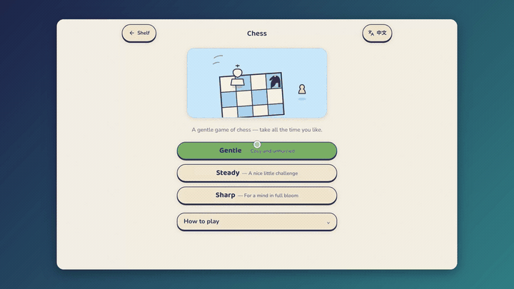

# Demo Follow · v8

Record a real website, capture its pointer events and UI bounds, and export a
walkthrough with stable semantic zoom, styled cursors, click animations,
adjustable pacing and framed backgrounds. No accounts,
model API keys or paid editing service are required.

Camera motion follows meaningful actions, holds framing during scrolls, and
checks the result of each planned action. Pointer timing is synchronized to
decoded real browser video. Browser capture and rendering have separate frame rates.

## Demo



Recorded on **BrainBloom**, a website created by this repository owner:
Gentle → Rules → scroll → Close → e2–e4. The preview shows the Playful style.

Watch or download the full 1080p demos (authorized GitHub sign-in required):

- [Playful · mint cursor and starburst clicks](https://github.com/megumikuo/demo-follow/releases/download/v8.0.0/demo-follow-v8-playful.mp4)
- [Studio · white pointer and teal ripples](https://github.com/megumikuo/demo-follow/releases/download/v8.0.0/demo-follow-v8-studio.mp4)
- [Punchy · ring cursor and faster pacing](https://github.com/megumikuo/demo-follow/releases/download/v8.0.0/demo-follow-v8-punchy.mp4)

The GIF is a smaller, 8 fps preview. Full MP4 exports are 1920 × 1080 at 60 fps;
the original browser capture is 25 fps.

## Download

Repository: [megumikuo/demo-follow](https://github.com/megumikuo/demo-follow).
The repository and its releases are private; sign in with an authorized GitHub account.

Get `demo-follow-v8.zip` from [Release v8.0.0](https://github.com/megumikuo/demo-follow/releases/tag/v8.0.0)
for the installable package. The release also includes Studio, Playful and Punchy
MP4 examples, a framing comparison, validation summary and SHA256 checksums.
Raw captures and personal recording telemetry are excluded from Git and releases.

Or clone the source with an authenticated GitHub CLI:

```sh
gh repo clone megumikuo/demo-follow
python3 demo-follow/scripts/install.py --agent both
```

## Install for Codex or Claude Code

Unzip the package, then run from the directory containing `demo-follow`:

```sh
python3 demo-follow/scripts/install.py --agent both
```

Use `--agent codex` or `--agent claude` for one tool. Existing installations are
not overwritten. For a custom or project destination:

```sh
python3 demo-follow/scripts/install.py --target /your/project/.agents/skills/demo-follow
```

The default destinations are `~/.agents/skills/demo-follow` for Codex
and `~/.claude/skills/demo-follow` for Claude Code, following the
[Codex skill documentation](https://learn.chatgpt.com/docs/build-skills) and
[Claude Code skill documentation](https://code.claude.com/docs/en/skills).
The same folder is portable between them. Invoke `$demo-follow` in
Codex or `/demo-follow` in Claude Code. Installation and local Python
execution were tested; a separate Claude Code agent session was not run.

## Set up and record

Run inside the installed skill folder. The tested environment is macOS arm64,
Python 3.14, Chromium supplied by Playwright 1.63.0. The pinned dependency set
requires a recent Python; other operating systems remain unverified.

```sh
python3 -m venv .venv
.venv/bin/python -m pip install -r requirements.txt
.venv/bin/python -m playwright install chromium
.venv/bin/python scripts/record.py examples/brainbloom-chess.json --out output/chess
.venv/bin/python scripts/render.py output/chess/raw.webm output/chess/events.json --out-dir output/chess
.venv/bin/python scripts/make_embed.py --out output/chess/embed.html
.venv/bin/python scripts/validate_video.py output/chess
```

On Windows use `.venv\Scripts\python.exe`. `imageio-ffmpeg` supplies the encoder;
a separate system ffmpeg installation is unnecessary. The recorder defaults to
headless Chromium; use `--headed` to watch it or `--browser /path/to/chromium`
for a compatible system browser. Use a new output directory for every capture.

For another website, inspect its live controls and adapt a plan using
[the action reference](references/action-plan.md). The agent translates the
user's requested steps into that plan; there is no standalone natural-language
planner service or automatic general-purpose selector discovery.

## Pick a look, then customize it

Reuse one real capture to produce different finished videos without recording
again. The default `studio` style is a white bold cursor, teal double ripple,
subtle cursor tilt and a graphite frame. `playful` uses a mint touch cursor,
orange starbursts and an aurora background. `punchy` uses a hollow ring cursor,
orange pulse, sunset background and faster playback. `classic` keeps a plain
frame with the system-like arrow/hand/text cursor.

| Preset | Playback | Camera transition | Cursor | Click effect |
| --- | --- | --- | --- | --- |
| `studio` | 1× | 1 second | Bold | Ripple |
| `playful` | 1.1× | 1 second | Touch | Spark |
| `punchy` | 1.4× | 0.95 seconds | Ring | Pulse |
| `classic` | 1× | 1 second | Auto | Ripple |

```sh
python scripts/render.py output/chess/raw.webm output/chess/events.json --out-dir output/playful --preset playful
python scripts/render.py output/chess/raw.webm output/chess/events.json --out-dir output/custom --preset studio --cursor-style ring --cursor-color '#FFE5A3' --cursor-size 1.5 --click-effect pulse --click-duration 0.4 --speed 1.25
```

Use `--click-effect none` for no click decoration. `--cursor-style auto` switches
between arrow, hand and text cursors using actual page telemetry. Cursor size is
independent of zoom. `--no-hide-idle` keeps the cursor visible; otherwise the
three styled presets fade it after an idle pause. `--no-rotate-cursor` disables
tilt. `--cursor-smoothing 0.025` adjusts smoothing in source seconds (0–0.1).
Actual click hotspots remain pinned to their recorded coordinates.

`--speed 0.25` through `--speed 3` changes playback speed. `--transition` changes
camera animation duration in source seconds; playback speed also changes its
apparent duration. For tutorials, keep reading sections at normal speed while
accelerating waiting or scrolling. `--speed-segments` accepts a JSON file:

```json
[{"start": 10.5, "end": 14.3, "speed": 1.25}]
```

These are source-time seconds, must be in bounds and cannot overlap. Event,
camera, cursor and video time all use the same reversible mapping.
[examples/chess-pacing.json](examples/chess-pacing.json) demonstrates pacing
for the included BrainBloom timing; adapt it for another recording.

`--background graphite|aurora|sunset|none`, `--padding`, `--corner-radius` and
`--canvas 1920x1080` control framing. The screen is fitted without stretching;
rounded corners and a soft shadow sit on the selected gradient. A custom canvas
fits the complete recording; it does not provide automatic portrait reframing.
`--preset classic --background none` preserves viewport-sized output.

Styled output defaults to 1920×1080 at 60 fps. This is a composed canvas, not a
claim of higher source resolution or AI detail reconstruction. `--mp4-only`
skips WebM for quick previews. Copy `events.json` beside each render before
validation.

For agent use, ask e.g. “用活潑風格，薄荷色圓點游標，點擊有星芒，影片快一點”.
The agent translates that into `--preset playful` and requested overrides.
You can also ask for a restrained tutorial, a faster product teaser, or three
style variants of the same capture.

## Outputs and quality

### Complete controls and balanced composition

When focusing a board or working panel, add `camera_context_selectors` for the
controls the viewer needs (navigation, Rules, Undo, a toolbar or dialog header).
The recorder measures their actual DOM rectangles; missing or clipped controls
fail capture. `safe_margin` requests viewport-pixel clearance, default 12.
The camera fits the primary region and required controls together, centers the
primary horizontally and the full composition vertically, and reduces zoom
before planning when needed. If a source control is already closer to an edge,
its original clearance limits the achievable margin; no fake UI or new border
pixels are inserted. Valid target poses are interpolated smoothly, retaining
the existing holds and scroll locks.

```json
{"camera_selector":"[aria-label='Chess board']",
 "camera_context_selectors":["button:has-text('Leave game')","button:has-text('Rules')","button:has-text('Undo')"],
 "camera_after":true,"shot":"context","zoom":1.25,"safe_margin":12}
```

Use `camera_after` when the primary and controls appear after an action.
Inspect both transition frames and steady frames; a complete button includes
its outline and shadow, not only its label. The validator rejects required
regions that cross the video-card edge and reports steady vertical balance.
Keep a useful zoom while protecting context; do not simply disable all zoom.
Protected compositions hold through the end so an automatic zoom-out does not
restore uneven whitespace. An explicit reset still returns to the full viewport.

- `demo.mp4`, `demo.webm`, `poster.jpg`, `embed.html`: delivery assets.
- `raw.webm`, `events.json`: real capture and synchronized action/pointer evidence.
- `action-*.png`: screenshots after each action; `failure.png` on failure.
- `camera-track.json`, `render-report.json`, `validation.json`, `contact-sheet.jpg`:
  review evidence. Inspect the frames before calling the result visually approved.

The delivered BrainBloom demo is the live flow: Gentle → Rules → scroll 700 px
inside the dialog → Close → select e2 → move to e4. It is not the old local
fixture. The original v6 verified run is 27.33 seconds, 1440×900, 60 fps
output over 25 fps source capture. The marker-based timing has one source-frame
quantization (40 ms at 25 fps). Brief sync colors occur only in raw pre-roll;
the delivered timeline starts after them.

`capture_scale: 2` controls browser DPR and PNG screenshots. Playwright's raw
video remains viewport-sized; this version does not claim true 2× video capture.
60 fps output does not invent extra source-page animation frames. Narration,
audio capture, subtitles, desktop capture and extension launchers are not included.

## Tests

```sh
.venv/bin/python -m unittest discover -s tests -v
```

The tests cover continuous later-shot entry, direct context handoffs, exact scroll
locks, viewport bounds, stationary ramp joins, rapid actions, drag zoom, safe
installation, navigation telemetry, video calibration and failure handling.
See [camera-and-validation.md](references/camera-and-validation.md) for what the
metrics establish and what still needs visual review.

V7 adds timeline, cursor, decoration and real-encoder tests to the earlier
camera, browser and installer suite. Local fixtures remain clearly labeled.

V8 adds full-control bounds, source-edge handling, balanced composition,
transition containment and final-hold regression tests. Its BrainBloom demo is
a fresh real-site capture with five successful action assertions; three styles
share that same recording. Required controls and the complete vertical working
composition are checked in every applicable output frame, including the tail.

The controls were informed by Screen Studio's public
[cursor guide](https://screen.studio/guide/cursor) and
[feature overview](https://screen.studio/). They are independently implemented
here; Screen Studio is not required. Optical motion blur, loupe zoom, audio
processing, webcam and transcript editing are not implemented here.

MIT license.
